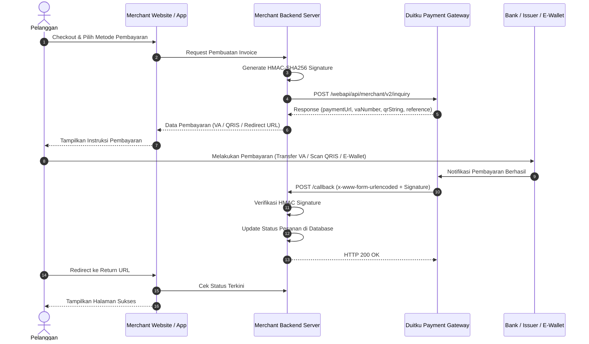

# Dokumentasi & Panduan Integrasi Duitku Payment Gateway API (v2.0)

Dokumentasi ini menyajikan referensi lengkap mengenai spesifikasi teknis, arsitektur alur transaksi, formula keamanan, endpoints API, kamus data, daftar channel pembayaran, serta implementasi standar untuk merchant yang mengintegrasikan **Duitku Payment Gateway**.

---

## Daftar Isi
1. [Pengenalan & Alur Kerja Integrasi](#1-pengenalan--alur-kerja-integrasi)
2. [Environment, Kredensial & Whitelist IP](#2-environment-kredensial--whitelist-ip)
3. [Spesifikasi Keamanan & Formula Signature (HMAC-SHA256)](#3-spesifikasi-keamanan--formula-signature-hmac-sha256)
4. [Referensi Endpoint API](#4-referensi-endpoint-api)
   - [4.1 Get Payment Method](#41-get-payment-method)
   - [4.2 Permintaan Transaksi (Inquiry / Create Transaction)](#42-permintaan-transaksi-inquiry--create-transaction)
   - [4.3 Callback (Webhook Notifikasi Pembayaran)](#43-callback-webhook-notifikasi-pembayaran)
   - [4.4 Redirect (Return URL)](#44-redirect-return-url)
   - [4.5 Cek Transaksi (Check Transaction Status)](#45-cek-transaksi-check-transaction-status)
5. [Struktur JSON Objects Khusus](#5-struktur-json-objects-khusus)
   - [5.1 Item Details](#51-item-details)
   - [5.2 Customer Detail & Address](#52-customer-detail--address)
   - [5.3 Account Link (OVO & Shopee)](#53-account-link-ovo--shopee)
   - [5.4 Credit Card Detail](#54-credit-card-detail)
6. [Daftar Kode Metode Pembayaran](#6-daftar-kode-metode-pembayaran)
7. [Masa Berlaku Transaksi (Expiry Period)](#7-masa-berlaku-transaksi-expiry-period)
8. [Daftar Kode Issuer QRIS](#8-daftar-kode-issuer-qris)
9. [Tabel HTTP Status Code & Error Handling](#9-tabel-http-status-code--error-handling)
10. [Panduan Uji Coba (Sandbox Testing)](#10-panduan-uji-coba-sandbox-testing)
11. [Contoh Implementasi Kode (Node.js / TypeScript & PHP)](#11-contoh-implementasi-kode-nodejs--typescript--php)
12. [Best Practices Keamanan Merchant](#12-best-practices-keamanan-merchant)

---

## 1. Pengenalan & Alur Kerja Integrasi

Duitku adalah platform *payment gateway* pihak ketiga (*third-party payment gateway*) di Indonesia yang memfasilitasi penerimaan pembayaran online melalui berbagai metode (Virtual Account, QRIS, E-Wallet, Retail Outlet, Kartu Kredit, Paylater, dll.) menggunakan satu integrasi API terpadu.

### Diagram Alur Transaksi Standar



---

## 2. Environment, Kredensial & Whitelist IP

Duitku menyediakan dua environment terpisah:

| Komponen | Sandbox (Development) | Production (Live) |
| :--- | :--- | :--- |
| **Base URL** | `https://sandbox.duitku.com` | `https://passport.duitku.com` |
| **Dashboard Merchant** | `https://sandbox.duitku.com/merchant` | `https://passport.duitku.com/merchant` |
| **Tujuan** | Uji coba integrasi dengan uang simulasi | Transaksi riil dengan dana sesungguhnya |

### Kredensial Proyek
* **Merchant Code (`merchantCode`)**: Kode pengenal proyek merchant dari Duitku Portal (contoh: `D1234`).
* **API Key (`apiKey`)**: Kunci otentikasi rahasia untuk membuat dan memverifikasi HMAC Signature.

### Daftar IP Outgoing Duitku (Whitelist)
Jika server merchant menerapkan firewall atau pembatasan IP masuk pada endpoint webhook callback, tambahkan daftar IP berikut:

* **Production**:
  * `182.23.85.14`
  * `103.177.101.190`
  * `182.23.85.8`, `182.23.85.9`, `182.23.85.10`, `182.23.85.13`
  * `103.177.101.184`, `103.177.101.185`, `103.177.101.186`, `103.177.101.189`
* **Sandbox**:
  * `182.23.85.11`, `182.23.85.12`
  * `103.177.101.187`, `103.177.101.188`

---

## 3. Spesifikasi Keamanan & Formula Signature (HMAC-SHA256)

> [!IMPORTANT]
> **Standar Signature API v2.0**:
> Duitku mewajibkan penggunaan algoritma **HMAC-SHA256** dengan `apiKey` sebagai secret key. Seluruh output signature harus berupa **string hexadecimal huruf kecil (lowercase)**. Metode lama (MD5 dan raw SHA-256) sudah dinyatakan **obsolete**.

### Formula Signature Setiap Operasi:

| Operasi | String to Sign | Formula Signature |
| :--- | :--- | :--- |
| **Get Payment Method** | `merchantcode + amount + datetime` | `HMAC_SHA256(stringToSign, apiKey)` |
| **Permintaan Transaksi (Inquiry)** | `merchantCode + merchantOrderId + paymentAmount` | `HMAC_SHA256(stringToSign, apiKey)` |
| **Callback Verification** | `merchantCode + amount + merchantOrderId` | `HMAC_SHA256(stringToSign, apiKey)` |
| **Cek Transaksi (Status Check)** | `merchantCode + merchantOrderId` | `HMAC_SHA256(stringToSign, apiKey)` |

---

## 4. Referensi Endpoint API

### 4.1 Get Payment Method

Digunakan untuk mengambil daftar channel pembayaran yang sedang aktif pada proyek merchant beserta nominal biaya (*fee*).

* **Method**: `POST`
* **Content-Type**: `application/json`
* **Endpoint Sandbox**: `https://sandbox.duitku.com/webapi/api/merchant/paymentmethod/getpaymentmethod`
* **Endpoint Production**: `https://passport.duitku.com/webapi/api/merchant/paymentmethod/getpaymentmethod`

#### Parameter Request
| Field | Tipe | Wajib | Keterangan | Contoh |
| :--- | :--- | :---: | :--- | :--- |
| `merchantcode` | string(50) | ✓ | Kode merchant dari portal Duitku | `D1234` |
| `amount` | integer | ✓ | Nominal transaksi (angka bulat tanpa desimal) | `50000` |
| `datetime` | string | ✓ | Format: `yyyy-MM-dd HH:mm:ss` | `2026-08-22 14:30:00` |
| `signature` | string(255) | ✓ | HMAC-SHA256(`merchantcode + amount + datetime`, `apiKey`) | `497fbf783...` |

#### Contoh Request (cURL)
```bash
curl -X POST https://sandbox.duitku.com/webapi/api/merchant/paymentmethod/getpaymentmethod \
  -H "Content-Type: application/json" \
  -d '{
    "merchantcode": "D1234",
    "amount": 50000,
    "datetime": "2026-08-22 14:30:00",
    "signature": "d842db69f70501fe69487b3d957611c2d4e47335f390a5895b0a762a1bf1f1a0"
  }'
```

#### Contoh Response (JSON)
```json
{
  "paymentFee": [
    {
      "paymentMethod": "SP",
      "paymentName": "ShopeePay QRIS",
      "paymentImage": "https://images.duitku.com/hotlink-ok/SP.PNG",
      "totalFee": "0"
    },
    {
      "paymentMethod": "BC",
      "paymentName": "BCA Virtual Account",
      "paymentImage": "https://images.duitku.com/hotlink-ok/BC.PNG",
      "totalFee": "3000"
    }
  ],
  "responseCode": "00",
  "responseMessage": "SUCCESS"
}
```

---

### 4.2 Permintaan Transaksi (Inquiry / Create Transaction)

Langkah utama pembuatan pesanan pembayaran baru ke Duitku untuk menghasilkan nomor Virtual Account, payload QRIS, atau URL pembayaran.

* **Method**: `POST`
* **Content-Type**: `application/json`
* **Endpoint Sandbox**: `https://sandbox.duitku.com/webapi/api/merchant/v2/inquiry`
* **Endpoint Production**: `https://passport.duitku.com/webapi/api/merchant/v2/inquiry`

#### Parameter Request
| Field | Tipe | Wajib | Keterangan | Contoh |
| :--- | :--- | :---: | :--- | :--- |
| `merchantCode` | string(50) | ✓ | Kode merchant proyek | `D1234` |
| `paymentAmount` | integer | ✓ | Nominal pembayaran (tanpa tanda titik/koma) | `100000` |
| `paymentMethod` | string(2) | ✓ | Kode channel pembayaran | `BC` |
| `merchantOrderId` | string(50) | ✓ | ID transaksi unik dari sistem merchant | `INV-20260822-001` |
| `productDetails` | string(255) | ✓ | Keterangan produk / layanan | `Pembayaran Order #001` |
| `email` | string(255) | ✓ | Email pelanggan | `customer@example.com` |
| `customerVaName` | string(20) | ✓ | Nama yang tampil di layar ATM / konfirmasi bank | `Budi Santoso` |
| `callbackUrl` | string(255) | ✓ | URL webhook penerima konfirmasi pembayaran | `https://merchant.com/api/callback` |
| `returnUrl` | string(255) | ✓ | URL pengalihan browser setelah transaksi | `https://merchant.com/checkout/finish` |
| `signature` | string(255) | ✓ | HMAC-SHA256(`merchantCode + merchantOrderId + paymentAmount`, `apiKey`) | `a1b2c3d4...` |
| `phoneNumber` | string(50) | ✗ | Nomor telepon pelanggan | `081234567890` |
| `additionalParam` | string(255) | ✗ | Parameter custom merchant (harus URL Encoded) | `customKey=customValue` |
| `merchantUserInfo`| string(255) | ✗ | Username / ID user di merchant | `user_123` |
| `expiryPeriod` | integer | ✗ | Masa berlaku transaksi dalam menit | `60` |
| `itemDetails` | Array of Obj | ✗* | Rincian item barang/jasa | `[ { "name": "Item A", "price": 100000, "quantity": 1 } ]` |
| `customerDetail` | Object | ✗* | Detail data pelanggan & alamat pengiriman/tagihan | Lihat [5.2](#52-customer-detail--address) |
| `accountLink` | Object | ✗* | Wajib untuk channel Account Link (`OL`, `SL`) | Lihat [5.3](#53-account-link-ovo--shopee) |
| `creditCardDetail`| Object | ✗ | Konfigurasi tambahan transaksi kartu kredit | Lihat [5.4](#54-credit-card-detail) |

*\*Keterangan Wajib Khusus:*
* Untuk metode pembayaran **Kredit / Paylater (`DN`, `AT`)**, parameter `customerDetail` dan `itemDetails` menjadi **wajib**.
* Untuk metode pembayaran **E-Commerce (`T1`, `T2`, `T3`)**, parameter `customerVaName` menjadi **wajib**.
* Total penjumlahan harga `itemDetails` (`price * quantity`) **harus sama persis** dengan `paymentAmount`.

#### Contoh Request Payload
```json
{
  "merchantCode": "D1234",
  "paymentAmount": 100000,
  "paymentMethod": "SP",
  "merchantOrderId": "ORDER-998822",
  "productDetails": "Beli 2x Kaos Polos",
  "additionalParam": "userId=45",
  "merchantUserInfo": "user_45",
  "customerVaName": "Budi Santoso",
  "email": "budi@example.com",
  "phoneNumber": "081234567890",
  "itemDetails": [
    {
      "name": "Kaos Polos Putih",
      "price": 50000,
      "quantity": 2
    }
  ],
  "customerDetail": {
    "firstName": "Budi",
    "lastName": "Santoso",
    "email": "budi@example.com",
    "phoneNumber": "081234567890",
    "billingAddress": {
      "firstName": "Budi",
      "lastName": "Santoso",
      "address": "Jl. Sudirman No. 10",
      "city": "Jakarta",
      "postalCode": "10220",
      "phone": "081234567890",
      "countryCode": "ID"
    }
  },
  "callbackUrl": "https://merchant.com/api/duitku/callback",
  "returnUrl": "https://merchant.com/checkout/success",
  "signature": "d842db69f70501fe69487b3d957611c2d4e47335f390a5895b0a762a1bf1f1a0",
  "expiryPeriod": 30
}
```

#### Contoh Response Payload
```json
{
  "merchantCode": "D1234",
  "reference": "D1234CX80TZJ85Q70QCI",
  "paymentUrl": "https://sandbox.duitku.com/topup/topupdirectv2.aspx?ref=BCA7WZ7EIDXXXXWEC",
  "vaNumber": "7007014001444348",
  "qrString": "00020101021226660014ID.DANA.WWW011893600911002151500102152006170915150010303UME51450015ID.OR.GPNQR.WWW02150000000000000000303UME520454995802ID5911Toko Jualan6013Jakarta Barat61051153062210117LQKI2LPMJQPKCIIS553033605405400006304502A",
  "appUrl": "https://tokopedia.app.link/...",
  "amount": "100000",
  "statusCode": "00",
  "statusMessage": "SUCCESS"
}
```

#### Parameter Response
| Parameter | Tipe | Keterangan |
| :--- | :--- | :--- |
| `merchantCode` | string(50) | Kode merchant |
| `reference` | string(255) | Nomor referensi unik Duitku (wajib disimpan di database merchant) |
| `paymentUrl` | string(255) | URL menuju halaman pembayaran checkout Duitku |
| `vaNumber` | string(20) | Nomor Virtual Account (khusus metode VA) |
| `qrString` | string(255) | String payload QRIS untuk di-render menjadi QR Code gambar |
| `appUrl` | string | URL deeplink untuk membuka aplikasi e-commerce / e-wallet |
| `amount` | integer | Nominal tagihan |
| `statusCode` | string | Kode status inquiry (`00` = Sukses dibuat) |
| `statusMessage`| string | Pesan status inquiry |

---

### 4.3 Callback (Webhook Notifikasi Pembayaran)

Ketika pelanggan menyelesaikan pembayaran, server Duitku mengirimkan HTTP POST secara asinkron ke `callbackUrl` merchant.

* **Method**: `POST`
* **Content-Type**: `application/x-www-form-urlencoded`
* **Port**: `80` atau `443`
* **Respon Wajib Merchant**: Mengembalikan status `HTTP 200 OK` (plain text `OK` atau JSON `{ "status": "OK" }`).

> [!WARNING]
> Jika server merchant tidak mengembalikan HTTP status 200 (misalnya timeout atau error 500), Duitku akan mengirim ulang notifikasi hingga **5 kali**. Jika tetap gagal, email pemberitahuan kegagalan callback akan dikirim ke merchant.

#### Parameter Callback dari Duitku
| Parameter | Tipe | Keterangan |
| :--- | :--- | :--- |
| `merchantCode` | string | Kode merchant |
| `amount` | number / string | Nominal pembayaran yang berhasil diselesaikan |
| `merchantOrderId` | string | ID transaksi dari merchant |
| `productDetail` | string | Detail keterangan produk |
| `additionalParam` | string | Parameter tambahan yang dikirim saat inquiry |
| `paymentCode` | string | Kode channel pembayaran yang digunakan (contoh: `SP`, `BC`) |
| `resultCode` | string | **`00`** = Sukses, **`01`** = Gagal |
| `merchantUserId` | string | Username / ID user di merchant |
| `reference` | string | Nomor referensi unik Duitku |
| `signature` | string | Signature HMAC-SHA256 untuk verifikasi keaslian pengirim |
| `publisherOrderId`| string | Nomor pesanan unik dari publisher / aggregator |
| `spUserHash` | string | Hash identitas user (khusus ShopeePay) |
| `settlementDate` | string | Estimasi tanggal dana masuk settlement (`YYYY-MM-DD`) |
| `issuerCode` | string | Kode issuer QRIS (contoh: `93600014` untuk BCA) |
| `customerName` | string | Nama akun pembayar (jika didukung oleh issuer bank) |

#### Verifikasi Keamanan Signature Callback
```typescript
const stringToSign = `${merchantCode}${amount}${merchantOrderId}`;
const calculatedSignature = crypto
  .createHmac('sha256', apiKey)
  .update(stringToSign)
  .digest('hex');

if (signature !== calculatedSignature) {
  // Tolak request! Kemungkinan percobaan manipulasi data
  throw new Error('Bad Signature');
}
```

---

### 4.4 Redirect (Return URL)

Setelah pelanggan menyelesaikan atau membatalkan pembayaran di halaman Duitku, browser pelanggan diarahkan kembali ke `returnUrl` merchant via HTTP `GET`.

* **Method**: `GET`
* **Contoh URL**:
  `https://merchant.com/finish?merchantOrderId=ORDER-998822&resultCode=00&reference=D1234CX80TXXX`

#### Parameter Redirect
| Parameter | Keterangan |
| :--- | :--- |
| `merchantOrderId` | Nomor transaksi unik dari merchant |
| `reference` | Nomor referensi transaksi dari Duitku |
| `resultCode` | **`00`** = Sukses, **`01`** = Pending, **`02`** = Dibatalkan / Gagal |

> [!CAUTION]
> **Aturan Penting**: Jangan mengupdate status transaksi di database hanya berdasarkan parameter `resultCode` di Return URL, karena URL browser dapat diubah secara sengaja oleh pengguna. Gunakan Callback Webhook atau API Cek Transaksi sebagai sumber kebenaran status.

---

### 4.5 Cek Transaksi (Check Transaction Status)

Digunakan untuk memeriksa status pembayaran secara manual atau melalui background scheduler (rekonsiliasi).

* **Method**: `POST`
* **Content-Type**: `application/json`
* **Endpoint Sandbox**: `https://sandbox.duitku.com/webapi/api/merchant/transactionStatus`
* **Endpoint Production**: `https://passport.duitku.com/webapi/api/merchant/transactionStatus`

#### Parameter Request
| Field | Tipe | Wajib | Keterangan | Contoh |
| :--- | :--- | :---: | :--- | :--- |
| `merchantCode` | string(50) | ✓ | Kode merchant | `D1234` |
| `merchantOrderId` | string(50) | ✓ | Nomor transaksi merchant yang ingin dicek | `ORDER-998822` |
| `signature` | string(255) | ✓ | HMAC-SHA256(`merchantCode + merchantOrderId`, `apiKey`) | `d842db69...` |

#### Contoh Response
```json
{
  "merchantOrderId": "ORDER-998822",
  "reference": "D1234CX80TZJ85Q70QCI",
  "amount": "100000",
  "fee": "0",
  "statusCode": "00",
  "statusMessage": "SUCCESS"
}
```

#### Keterangan `statusCode`:
* **`00`**: `SUCCESS` (Pembayaran berhasil/lunas)
* **`01`**: `PENDING / PROCESS` (Menunggu pembayaran pelanggan)
* **`02`**: `CANCELED / FAILED / EXPIRED` (Transaksi gagal, dibatalkan, atau kedaluwarsa)

---

## 5. Struktur JSON Objects Khusus

### 5.1 Item Details
Daftar rincian item yang dibeli dalam transaksi.

```json
"itemDetails": [
  {
    "name": "Barang A",
    "price": 50000,
    "quantity": 1
  },
  {
    "name": "Barang B",
    "price": 25000,
    "quantity": 2
  }
]
```
* **Aturan**: Total $\sum(\text{price} \times \text{quantity})$ wajib bernilai sama dengan `paymentAmount`.

---

### 5.2 Customer Detail & Address
Informasi identitas pelanggan dan alamat penagihan/pengiriman.

```json
"customerDetail": {
  "firstName": "John",
  "lastName": "Doe",
  "email": "john.doe@example.com",
  "phoneNumber": "081234567890",
  "billingAddress": {
    "firstName": "John",
    "lastName": "Doe",
    "address": "Jl. Gatot Subroto No. 45",
    "city": "Jakarta Selatan",
    "postalCode": "12930",
    "phone": "081234567890",
    "countryCode": "ID"
  },
  "shippingAddress": {
    "firstName": "John",
    "lastName": "Doe",
    "address": "Jl. Gatot Subroto No. 45",
    "city": "Jakarta Selatan",
    "postalCode": "12930",
    "phone": "081234567890",
    "countryCode": "ID"
  }
}
```

---

### 5.3 Account Link (OVO & Shopee)
Parameter khusus untuk metode pembayaran direct token linking (`OL` dan `SL`).

```json
"accountLink": {
  "credentialCode": "7cXXXXX-XXXX-XXXX-9XXX-944XXXXXXX8",
  "ovo": {
    "paymentDetails": [
      {
        "paymentType": "CASH",
        "amount": 100000
      }
    ]
  },
  "shopee": {
    "useCoin": false,
    "promoId": ""
  }
}
```

---

### 5.4 Credit Card Detail
Konfigurasi khusus untuk transaksi Kartu Kredit (`VC`).

```json
"creditCardDetail": {
  "acquirer": "014",
  "binWhitelist": ["014", "022", "400000"]
}
```
* `acquirer`: `014` (BCA), `022` (CIMB).
* `binWhitelist`: Array kode bank atau 6 digit BIN kartu kredit yang diizinkan (maksimal 25 BIN).

---

## 6. Daftar Kode Metode Pembayaran

| Kategori | Kode | Nama Metode Pembayaran |
| :--- | :--- | :--- |
| **QRIS** | `SP` | ShopeePay QRIS / Universal QRIS (BCA, GoPay, OVO, DANA, dll) |
| | `NQ` | Nobu QRIS |
| | `GQ` | Gudang Voucher QRIS |
| | `SQ` | Nusapay QRIS |
| **Virtual Account** | `BC` | BCA Virtual Account |
| | `M2` | Mandiri Virtual Account |
| | `BR` | BRIVA (BRI Virtual Account) |
| | `I1` | BNI Virtual Account |
| | `BV` | BSI (Bank Syariah Indonesia) Virtual Account |
| | `BT` | Permata Bank Virtual Account |
| | `B1` | CIMB Niaga Virtual Account |
| | `DM` | Danamon Virtual Account |
| | `VA` | Maybank Virtual Account |
| | `NC` | Bank Neo Commerce (BNC) |
| | `S1` | Bank Sahabat Sampoerna |
| | `AG` | Bank Artha Graha |
| | `A1` | ATM Bersama |
| **E-Wallet** | `OV` | OVO (Support Void) |
| | `SA` | ShopeePay App (Support Void) |
| | `DA` | DANA |
| | `LF` | LinkAja Apps (Fixed Fee) |
| | `LA` | LinkAja Apps (Percentage Fee) |
| | `OL` | OVO Account Link |
| | `SL` | ShopeePay Account Link |
| **Retail Outlet** | `FT` | Pegadaian / Alfamart / Pos Indonesia |
| | `IR` | Indomaret |
| **Kartu Kredit** | `VC` | Credit Card (Visa / MasterCard / JCB) |
| **E-Banking** | `JP` | Jenius Pay |
| **Paylater / Kredit**| `DN` | Indodana Paylater |
| | `AT` | ATOME |
| **E-Commerce** | `T1` | Tokopedia Card Payment |
| | `T2` | Tokopedia E-Wallet |
| | `T3` | Tokopedia Others |

---

## 7. Masa Berlaku Transaksi (Expiry Period)

Durasi waktu kedaluwarsa pembayaran dalam satuan menit:

| Jenis Pembayaran | Default Expiry Period | Maksimal Expiry Period |
| :--- | :--- | :--- |
| **Virtual Account** | 1440 Menit (24 Jam) | > 1440 Menit |
| **QRIS (ShopeePay)** | 10 Menit | 60 Menit |
| **QRIS (Nobu)** | 24 Menit | 1440 Menit |
| **E-Wallet (OVO / ShopeePay)** | 10 Menit | 60 - 1440 Menit |
| **E-Wallet (DANA)** | 1440 Menit | 1440 Menit |
| **Retail (Alfamart / Indomaret)** | 1440 Menit | > 1440 Menit |
| **Kartu Kredit** | 30 Menit (Fixed)* | 30 Menit |
| **Jenius Pay** | 10 Menit | 10 Menit |

*\*Catatan*: Untuk Kartu Kredit, OVO Account Link, dan Shopee Account Link, nilai `expiryPeriod` mengikuti default sistem.

---

## 8. Daftar Kode Issuer QRIS

Kode issuer yang dikirimkan Duitku pada parameter `issuerCode` di Webhook Callback:

| Kode Issuer | Nama Bank / Platform Penerbit |
| :--- | :--- |
| `93600014` | BCA (Bank Central Asia) |
| `93600002` | BRI (Bank Rakyat Indonesia) |
| `93600008` | Bank Mandiri |
| `93600009` | BNI (Bank Negara Indonesia) |
| `93600200` | BTN |
| `93600011` | Bank Danamon |
| `93600013` | Permata Bank |
| `93600022` | CIMB Niaga |
| `93600451` | Bank Syariah Indonesia (BSI) |
| `93600914` | GoPay |
| `93600912` | OVO |
| `93600915` | DANA |
| `93600918` | ShopeePay |
| `93600911` | LinkAja |
| `93600213` | Jenius (BTPN) |
| `93600542` | Bank Jago |
| `93600535` | SeaBank |
| `93600490` | Bank Neo Commerce |
| `93600822` | AstraPay |

---

## 9. Tabel HTTP Status Code & Error Handling

| HTTP Code | Pesan / Error Response | Penyebab & Tindakan Solusi |
| :--- | :--- | :--- |
| **`200`** | `SUCCESS` | Permintaan berhasil diproses |
| **`400`** | `Minimum Payment 10000 IDR` | Nominal kurang dari batas minimum Rp 10.000 |
| **`400`** | `Maximum Payment exceeded` | Nominal melebihi limit batas channel pembayaran |
| **`400`** | `paymentMethod is mandatory` | Parameter `paymentMethod` kosong |
| **`400`** | `merchantOrderId is mandatory` | Parameter `merchantOrderId` belum diisi |
| **`400`** | `length of merchantOrderId can't > 50` | ID transaksi melebihi batas 50 karakter |
| **`400`** | `Invalid Email Address` | Format alamat email tidak valid |
| **`400`** | `Customer VA Name must not be empty` | Parameter `customerVaName` wajib untuk channel VA / E-Commerce |
| **`401`** | `Wrong signature` | Signature tidak cocok. Periksa urutan string to sign dan API key |
| **`404`** | `Merchant not found` | `merchantCode` tidak terdaftar di sistem Duitku |
| **`404`** | `Payment channel not available` | Metode pembayaran belum diaktifkan di portal Duitku |
| **`409`** | `Payment amount must be equal to all item price` | Selisih antara `paymentAmount` dengan total harga pada `itemDetails` |

---

## 10. Panduan Uji Coba (Sandbox Testing)

### 1. Uji Coba Virtual Account (VA)
1. Buat permintaan transaksi (Inquiry) menggunakan channel VA (misal `BC`, `BR`, `M2`, `VA`).
2. Dapatkan nomor `vaNumber` dari response Duitku.
3. Buka halaman simulator resmi:
   👉 **[Duitku VA Demo Simulator](https://sandbox.duitku.com/payment/demo/demosuccesstransaction.aspx)**
4. Masukkan nomor Virtual Account lalu klik **Bayar**.
5. Server Duitku Sandbox akan secara otomatis menembak `callbackUrl` Anda.

### 2. Uji Coba QRIS & E-Wallet
1. Buat transaksi dengan channel `SP` atau `NQ`.
2. Buka `paymentUrl` yang didapatkan di browser.
3. Pada halaman pembayaran simulasi Duitku Sandbox, tekan tombol konfirmasi pembayaran simulator untuk memicu callback.

### 3. Menguji Webhook Callback di Localhost
Untuk menerima callback dari server Duitku saat development lokal di komputer pribadi:
1. Buat public tunnel menggunakan tools seperti **ngrok** atau **Cloudflare Tunnel**:
   ```bash
   ngrok http 3000
   # atau
   npx cloudflared tunnel --url http://localhost:3000
   ```
2. Pasang URL tunnel pada `callbackUrl` saat melakukan request transaksi inquiry:
   `https://xxx.ngrok-free.app/api/duitku/callback`

---

## 11. Contoh Implementasi Kode (Node.js / TypeScript & PHP)

### A. Node.js / TypeScript (Express.js)

#### 1. Modul Service Duitku (`duitkuService.ts`)
```typescript
import crypto from 'crypto';

interface DuitkuEnv {
  merchantCode: string;
  apiKey: string;
  baseUrl: string;
}

const config: DuitkuEnv = {
  merchantCode: process.env.DUITKU_MERCHANT_CODE || 'D1234',
  apiKey: process.env.DUITKU_API_KEY || 'SECRET_API_KEY',
  baseUrl: process.env.DUITKU_ENV === 'production'
    ? 'https://passport.duitku.com'
    : 'https://sandbox.duitku.com',
};

export function createHmacSha256(data: string, key: string): string {
  return crypto.createHmac('sha256', key).update(data).digest('hex');
}

export async function requestInquiry(params: {
  merchantOrderId: string;
  paymentAmount: number;
  paymentMethod: string;
  productDetails: string;
  email: string;
  customerVaName: string;
  callbackUrl: string;
  returnUrl: string;
  expiryPeriod?: number;
}) {
  const stringToSign = `${config.merchantCode}${params.merchantOrderId}${params.paymentAmount}`;
  const signature = createHmacSha256(stringToSign, config.apiKey);

  const payload = {
    merchantCode: config.merchantCode,
    paymentAmount: params.paymentAmount,
    paymentMethod: params.paymentMethod,
    merchantOrderId: params.merchantOrderId,
    productDetails: params.productDetails,
    customerVaName: params.customerVaName,
    email: params.email,
    callbackUrl: params.callbackUrl,
    returnUrl: params.returnUrl,
    signature,
    expiryPeriod: params.expiryPeriod || 60,
    itemDetails: [
      {
        name: params.productDetails,
        price: params.paymentAmount,
        quantity: 1,
      },
    ],
  };

  const response = await fetch(`${config.baseUrl}/webapi/api/merchant/v2/inquiry`, {
    method: 'POST',
    headers: { 'Content-Type': 'application/json' },
    body: JSON.stringify(payload),
  });

  const data = await response.json();
  if (!response.ok) {
    throw new Error(data.Message || data.statusMessage || 'Inquiry Duitku gagal');
  }

  return data;
}

export function verifyCallback(body: {
  merchantCode: string;
  amount: string | number;
  merchantOrderId: string;
  signature: string;
}): boolean {
  const stringToSign = `${body.merchantCode}${body.amount}${body.merchantOrderId}`;
  const calculated = createHmacSha256(stringToSign, config.apiKey);
  return calculated === body.signature;
}
```

#### 2. Express Controller (`app.ts`)
```typescript
import express, { Request, Response } from 'express';
import { requestInquiry, verifyCallback } from './duitkuService';

const app = express();

// PENTING: Callback Duitku menggunakan form urlencoded
app.use(express.urlencoded({ extended: true }));
app.use(express.json());

// Endpoint Create Invoice
app.post('/api/checkout', async (req: Request, res: Response) => {
  try {
    const { orderId, amount, paymentMethod, email, customerName } = req.body;

    const result = await requestInquiry({
      merchantOrderId: orderId,
      paymentAmount: Number(amount),
      paymentMethod,
      productDetails: `Order ${orderId}`,
      email,
      customerVaName: customerName,
      callbackUrl: 'https://merchant.com/api/duitku/callback',
      returnUrl: 'https://merchant.com/checkout/finish',
    });

    res.json(result);
  } catch (err: any) {
    res.status(500).json({ error: err.message });
  }
});

// Endpoint Webhook Callback
app.post('/api/duitku/callback', async (req: Request, res: Response) => {
  try {
    const { merchantCode, amount, merchantOrderId, signature, resultCode } = req.body;

    const isValid = verifyCallback({ merchantCode, amount, merchantOrderId, signature });
    if (!isValid) {
      return res.status(400).send('Bad Signature');
    }

    if (resultCode === '00') {
      // Pembayaran Sukses -> Update database order menjadi LUNAS
      console.log(`Pesanan ${merchantOrderId} berhasil dibayar sejumlah Rp ${amount}`);
    } else {
      // Pembayaran Gagal / Dibatalkan
      console.log(`Pesanan ${merchantOrderId} gagal dibayar.`);
    }

    // Wajib kembalikan HTTP 200 OK
    res.status(200).send('OK');
  } catch (error) {
    res.status(500).send('Internal Server Error');
  }
});

app.listen(3000, () => console.log('Server berjalan di port 3000'));
```

---

### B. PHP Standar

#### 1. Create Transaction (`inquiry.php`)
```php
<?php
$merchantCode = 'D1234';
$apiKey = 'SECRET_API_KEY';
$paymentAmount = 100000;
$merchantOrderId = 'ORDER-' . time();
$paymentMethod = 'BC'; // BCA Virtual Account

$stringToSign = $merchantCode . $merchantOrderId . $paymentAmount;
$signature = hash_hmac('sha256', $stringToSign, $apiKey);

$payload = array(
    'merchantCode'    => $merchantCode,
    'paymentAmount'   => $paymentAmount,
    'paymentMethod'   => $paymentMethod,
    'merchantOrderId' => $merchantOrderId,
    'productDetails'  => 'Pembayaran Pesanan #' . $merchantOrderId,
    'customerVaName'  => 'Budi Santoso',
    'email'           => 'customer@example.com',
    'phoneNumber'     => '081234567890',
    'callbackUrl'     => 'https://merchant.com/callback.php',
    'returnUrl'       => 'https://merchant.com/finish.php',
    'signature'       => $signature,
    'expiryPeriod'    => 60,
    'itemDetails'     => array(
        array(
            'name'     => 'Pembayaran Pesanan',
            'price'    => $paymentAmount,
            'quantity' => 1
        )
    )
);

$url = 'https://sandbox.duitku.com/webapi/api/merchant/v2/inquiry';
$ch = curl_init();
curl_setopt($ch, CURLOPT_URL, $url);
curl_setopt($ch, CURLOPT_CUSTOMREQUEST, "POST");
curl_setopt($ch, CURLOPT_POSTFIELDS, json_encode($payload));
curl_setopt($ch, CURLOPT_RETURNTRANSFER, true);
curl_setopt($ch, CURLOPT_HTTPHEADER, array(
    'Content-Type: application/json',
    'Content-Length: ' . strlen(json_encode($payload))
));

$response = curl_exec($ch);
curl_close($ch);

$result = json_decode($response, true);
header('Content-Type: application/json');
echo json_encode($result);
?>
```

#### 2. Callback Webhook (`callback.php`)
```php
<?php
$apiKey = 'SECRET_API_KEY';

$merchantCode    = isset($_POST['merchantCode']) ? $_POST['merchantCode'] : null;
$amount          = isset($_POST['amount']) ? $_POST['amount'] : null;
$merchantOrderId = isset($_POST['merchantOrderId']) ? $_POST['merchantOrderId'] : null;
$signature       = isset($_POST['signature']) ? $_POST['signature'] : null;
$resultCode      = isset($_POST['resultCode']) ? $_POST['resultCode'] : null;
$reference       = isset($_POST['reference']) ? $_POST['reference'] : null;

if (!empty($merchantCode) && !empty($amount) && !empty($merchantOrderId) && !empty($signature)) {
    $stringToSign = $merchantCode . $amount . $merchantOrderId;
    $calculatedSignature = hash_hmac('sha256', $stringToSign, $apiKey);

    if ($signature === $calculatedSignature) {
        if ($resultCode === "00") {
            // Status Sukses: Ubah status pesanan di database menjadi Lunas (PAID)
            http_response_code(200);
            echo "OK";
        } else {
            // Status Gagal
            http_response_code(200);
            echo "FAILED";
        }
    } else {
        http_response_code(400);
        echo "Bad Signature";
    }
} else {
    http_response_code(400);
    echo "Bad Parameter";
}
?>
```

---

## 12. Best Practices Keamanan Merchant

1. **Idempotency Check**:
   Sistem backend merchant harus bersifat idempoten terhadap Webhook Callback. Jika sebuah `merchantOrderId` sudah bertatus lunas, kembalikan `HTTP 200 OK` tanpa memproses ulang mutasi transaksi atau menambah stok ganda.
2. **Kesesuaian Nominal Transaksi**:
   Selalu bandingkan nilai `amount` yang diterima pada callback dengan nilai asli yang tersimpan di database merchant saat inquiry dibuat. Jangan menerima callback jika terdapat perbedaan nominal.
3. **Penyimpanan API Key**:
   Simpan `DUITKU_API_KEY` dan `DUITKU_MERCHANT_CODE` secara aman di Environment Variables backend server. Jangan pernah memasukkan API Key di repository publik atau mengeksposnya ke frontend / client side.
4. **Verifikasi Status Ganda**:
   Untuk transaksi dengan nominal besar, lakukan verifikasi tambahan dengan memanggil endpoint **Cek Transaksi** (`transactionStatus`) setelah menerima webhook callback sebelum menyerahkan barang/jasa kepada pelanggan.
